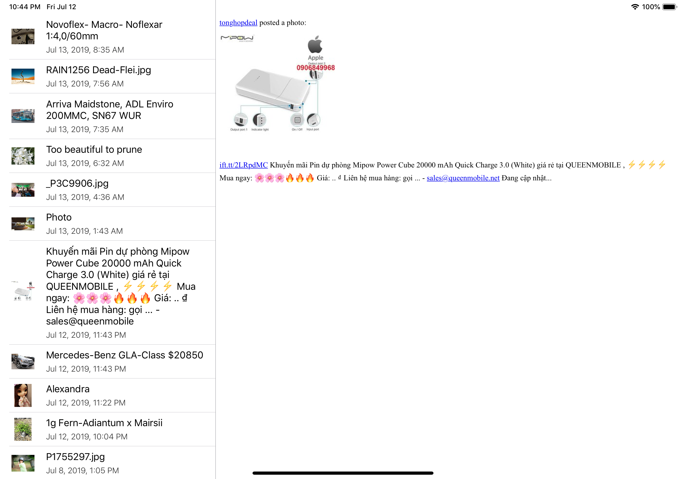

# Paytouch home exercise

<center>

|Demo|
|---|
||

</center>

### Requirements

Language: `Objective-C`, iOS deployment target: `12.2`.

Cocoapods `1.7.0`.

### Setup
Installed pods are included in the repository. Project runs out of the box.
In case of manual pods installation, run:

```
pod repo update
pod install
```

### Covering notes

Working with persisted objects and dividing Core Data layer from presentation in module architecture based on: [https://github.com/akantsevoi/CacheTracker](https://github.com/akantsevoi/CacheTracker)


### Shortcuts and rough edges

- Naming prefixes omitted in case of test exercise.
- Media link taken by brutforce key unwrapping json dict.
- Didn't use constant generators for assets, etc...
- Didn't setup primary key for objects. Clear and reinsert objects on each data pull.
- Data displayed in details view is kept until new object is selected and not being cleared if corresponding object is deleted during refresh.
- Error is displayed straight from view controller without using reusable convenience extensions.